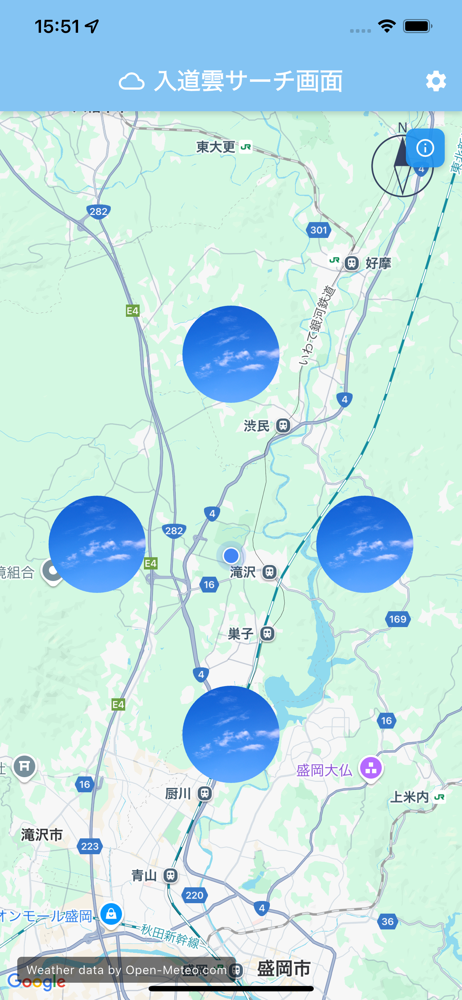
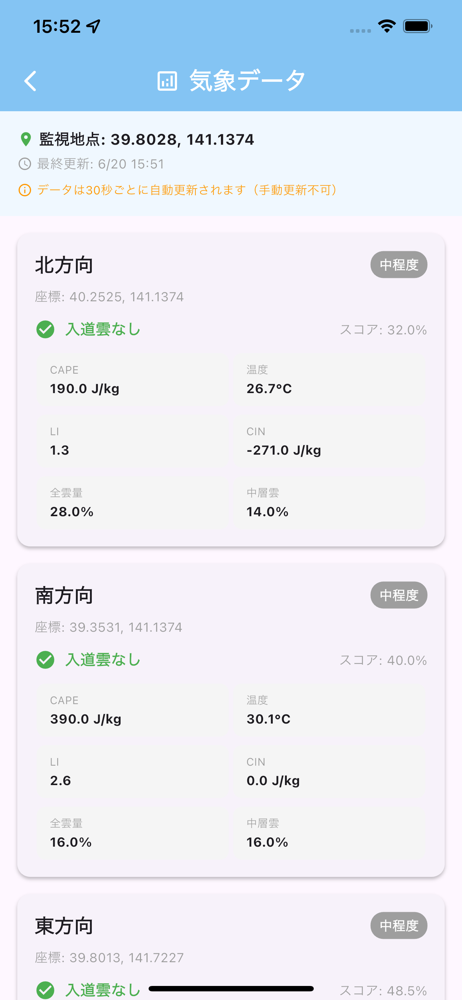
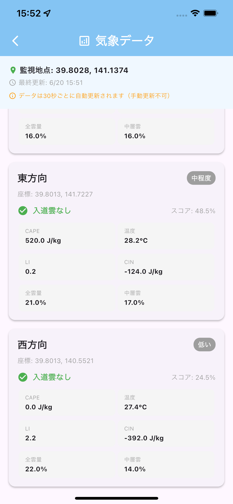

# 入道雲サーチアプリ

美しい入道雲の発生を検出・通知し、写真撮影・共有を楽しむ総合アプリです。

## 📱 アプリ画面

### メイン画面


現在地を中心に東西南北4方向の入道雲発生状況を表示。青い円は各方向の気象状況を示し、入道雲検出時は雲の画像に、晴天時は青空の画像に自動切り替えされます。

### 気象データ詳細画面
<div style="display: flex; gap: 10px;">
  
  
</div>

右上の「気象データ」ボタンから、各方向の詳細な気象データを確認できます。30秒ごとに自動更新され、入道雲発生可能性を総合スコアで表示します。

## ✨ 主な機能

### 🌩️ 入道雲監視機能
- **リアルタイム入道雲検出**: 現在位置周辺12地点を5分間隔で自動監視
- **詳細気象データ表示**: CAPE値、リフティド指数、気温などの専門データを表示
- **プッシュ通知**: 入道雲発生時に即座に通知
- **地図連携**: Google Maps上で方向を視覚的に表示
- **自動更新**: 30秒間隔でのリアルタイムデータ更新
- **夜間モード**: 20時〜8時は入道雲発生確率が極めて低いため監視を停止

### 📸 写真機能
- **カメラ撮影**: アプリ内カメラで入道雲を撮影
- **写真投稿**: 撮影した写真をコミュニティに投稿・共有
- **ローカル保存**: 写真をデバイスに保存
- **ギャラリー管理**: マイフォトの閲覧・管理

### 👥 コミュニティ機能
- **写真共有**: ユーザー同士で入道雲写真を共有
- **いいね機能**: 気に入った写真にいいねを付与
- **写真ダウンロード**: 他のユーザーの写真をギャラリーに保存
- **自動期限管理**: 投稿から30日後に自動削除でプライバシー保護

## 🎯 使い方

1. **位置情報許可**: アプリ起動時に位置情報の利用を許可
2. **通知許可**: 入道雲発生時の通知を受け取るため通知を許可
3. **地図確認**: メイン画面で現在地と気象状況を確認
4. **詳細データ**: 右上の「気象データ」ボタンで詳細情報を表示
5. **写真撮影**: カメラボタンで入道雲を撮影・投稿
6. **コミュニティ**: 他のユーザーの写真を閲覧・いいね・ダウンロード
7. **通知受信**: 入道雲発生時に自動で通知を受信

## 🔬 入道雲判定システム

### 分析指標
| 指標 | 重み | 説明 |
|------|------|------|
| CAPE | 50% | 対流有効位置エネルギー（積乱雲発生の主要指標） |
| リフティド指数 | 35% | 大気の安定度 |
| CIN | 5% | 対流抑制エネルギー |
| 気温 | 10% | 基本的な気象要素 |

### 判定基準
- **50%以上**: 入道雲の可能性あり（通知送信）
- **50%未満**: 入道雲の可能性低い

### 夜間モード
- **20時〜8時**: 入道雲発生確率が極めて低いため監視を停止
- **省エネ設計**: 夜間はAPIリクエストを停止してリソースを節約

## 🛡️ プライバシー

本アプリのプライバシーポリシー：[プライバシーポリシー](https://tsuchida-y.github.io/thunder_cloud_app/privacy_policy.html)

### プライバシー保護機能
- **座標精度制限**: 位置情報は小数点2位（約1km精度）に制限
- **自動削除**: 投稿写真は30日後に自動削除
- **期限管理**: いいねデータも30日後に自動削除

## 📞 お問い合わせ

- **開発者**: Tsuchida Yuto
- **GitHub Issues**: https://github.com/tsuchida-y/thunder_cloud_app/issues

---

## 🔧 技術情報（開発者向け）

### 技術スタック
- **Frontend**: Flutter
- **Backend**: Firebase (Cloud Functions, Firestore, FCM, Storage)
- **地図**: Google Maps API
- **気象データ**: Open-Meteo API

### アーキテクチャ
サービス指向アーキテクチャ（SOA）を採用し、以下のサービスで構成：

**コアサービス**
- `AppInitialization`: アプリ初期化（並列処理で高速化）
- `FCMTokenManager`: プッシュ通知トークン管理
- `LocationService`: 位置情報取得・管理
- `WeatherDataService`: 気象データ管理
- `WeatherCacheService`: 気象データキャッシュ管理

**写真関連サービス**
- `PhotoService`: 写真のアップロード・管理・削除
- `LocalPhotoService`: ローカル写真管理
- `CameraService`: カメラ機能
- `UserService`: ユーザー情報管理

**UI層**
- `WeatherScreen`: メイン画面
- `SettingsScreen`: 気象データ詳細画面
- `CameraScreen`: カメラ撮影画面
- `GalleryScreen`: ギャラリー画面
- `CommunityScreen`: コミュニティ画面

### 開発環境セットアップ

```bash
# 依存関係のインストール
flutter pub get

# Firebase設定
# 1. Firebase Consoleでプロジェクト作成
# 2. iOS/Android アプリ登録
# 3. 設定ファイル配置:
#    - iOS: ios/Runner/GoogleService-Info.plist
#    - Android: android/app/google-services.json

# Cloud Functions デプロイ
cd functions
npm install
firebase deploy --only functions

# アプリ起動
flutter run
```

### パフォーマンス最適化
- **並列初期化**: サービス初期化を並列実行し起動速度を大幅改善
- **インテリジェントキャッシュ**: FCMトークン、位置情報、気象データのキャッシュで重複処理削減
- **効率的なAPI利用**: 夜間モード・手動更新削除によりAPIリクエスト数を大幅削減
- **自動クリーンアップ**: 期限切れデータの自動削除でストレージ最適化

### 通知システム
- **サーバーサイド**: Cloud Functions による5分間隔の自動チェック
- **クライアントサイド**: Firebase Cloud Messaging によるプッシュ通知
- **ローカル通知**: アプリ起動中の即座通知
- **夜間モード**: 20時〜8時は通知チェックを停止

### 写真管理システム
- **Firebase Storage**: 写真ファイルの安全な保存
- **Firestore**: 写真メタデータとコミュニティ機能
- **自動期限管理**: 30日後の自動削除でプライバシー保護
- **ローカル同期**: デバイス内ギャラリーとの連携

### APIリクエスト最適化
- **夜間モード**: 20時〜8時は全APIリクエストを停止
- **写真投稿最適化**: 投稿時の気象データ取得を削除
- **手動更新削除**: 設定画面の手動更新機能を削除
- **キャッシュ活用**: 5分間隔の自動更新データを効率活用

**50人利用時の想定APIリクエスト数**
- Firebase Functions自動実行: 288回/日
- アプリ起動時の取得: 350回/日
- 合計: 約638回/日（Open-Meteo無料枠10,000回/日の6.4%）

### 今後の展望
- **機能拡張**: 通知カスタマイズ、履歴機能、お気に入り地点
- **UI/UX改善**: アニメーション、アクセシビリティ対応
- **データ分析**: 入道雲出現パターンの分析・可視化
- **マルチリージョン対応**: 世界各地での利用拡張
