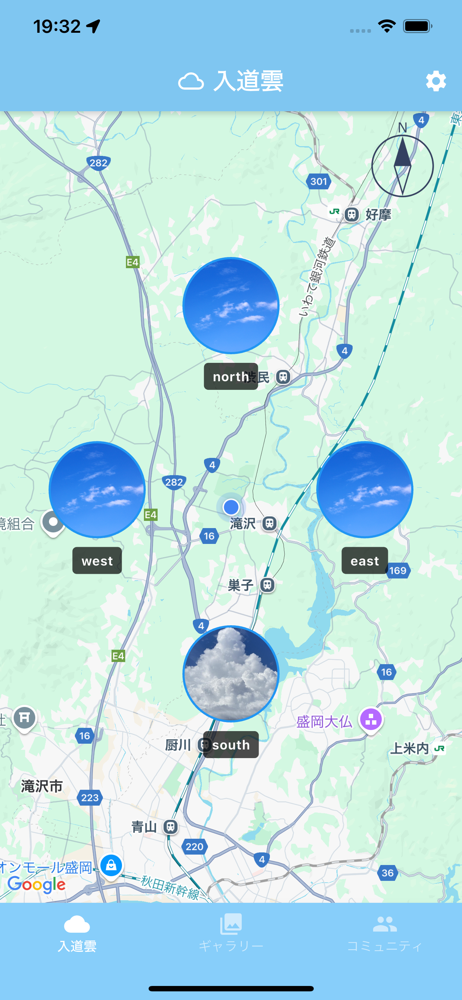
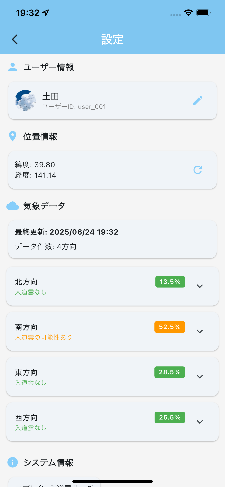
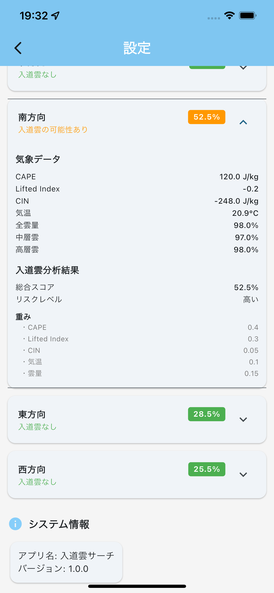
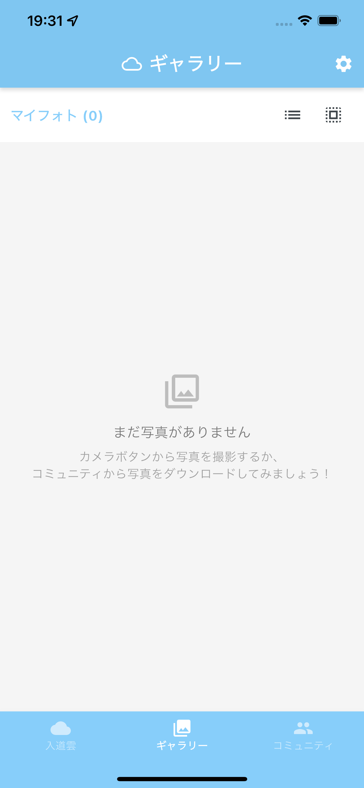
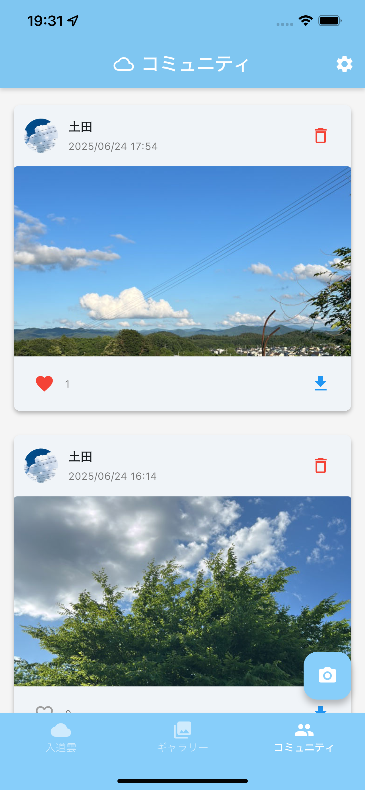

# 入道雲サーチアプリ

美しい入道雲の発生を検出・通知し、写真撮影・共有を楽しむ総合アプリです。

## アプリ画面

### メイン画面


現在地を中心に東西南北4方向の入道雲発生状況を表示。青い円は各方向の気象状況を示し、入道雲検出時は雲の画像に、晴天時は青空の画像に自動切り替えされます。

### 設定画面
<div style="display: flex; gap: 10px;">
  
  
</div>

アプリの設定を管理できます。ユーザーアバターの登録、ユーザー名の設定、詳細な気象情報や位置情報の確認ができます。

### ギャラリー画面


撮影した写真やダウンロードした写真の管理・閲覧ができます。ローカルに保存された写真を一覧表示し、詳細表示や削除が可能です。

### コミュニティ画面


他のユーザーが投稿した入道雲写真を閲覧できます。いいね機能や写真ダウンロード機能でコミュニティを楽しめます。

## 主な機能

### 🌩️ 入道雲監視機能
- **リアルタイム入道雲検出**: 現在位置周辺12地点を5分間隔で自動監視
- **詳細気象データ表示**: CAPE値、リフティド指数、気温などの専門データを表示
- **プッシュ通知**: 入道雲発生時に即座に通知
- **地図連携**: Google Maps上で方向を視覚的に表示
- **自動更新**: 30秒間隔でのリアルタイムデータ更新
- **位置情報自動追跡**: 1km移動で位置情報を自動更新、地図中心も自動移動
- **夜間モード**: 20時〜8時は入道雲発生確率が極めて低いため監視を停止（適切なメッセージ表示）

### 📸 写真機能
- **カメラ撮影**: アプリ内カメラで入道雲を撮影
- **写真投稿**: 撮影した写真をコミュニティに投稿・共有
- **ローカル保存**: 写真をデバイスに保存
- **ギャラリー管理**: マイフォトの閲覧・管理

### 👥 コミュニティ機能
- **写真共有**: ユーザー同士で入道雲写真を共有
- **いいね機能**: 気に入った写真にいいねを付与
- **写真ダウンロード**: 他のユーザーの写真をギャラリーに保存
- **自動期限管理**: 投稿から30日後に自動削除でプライバシー保護

## 🎯 使い方

1. **位置情報許可**: アプリ起動時に位置情報の利用を許可
2. **通知許可**: 入道雲発生時の通知を受け取るため通知を許可
3. **地図確認**: メイン画面で現在地と気象状況を確認
4. **詳細データ**: 右上の「気象データ」ボタンで詳細情報を表示
5. **移動時の自動更新**: 1km以上移動すると位置情報が自動更新され、地図の中心も新しい位置に移動
6. **写真撮影**: カメラボタンで入道雲を撮影・投稿
7. **コミュニティ**: 他のユーザーの写真を閲覧・いいね・ダウンロード
8. **通知受信**: 入道雲発生時に自動で通知を受信

## 🔬 入道雲判定システム

### 分析指標
| 指標 | 重み | 説明 |
|------|------|------|
| CAPE | 40% | 対流有効位置エネルギー（積乱雲発生の主要指標） |
| リフティド指数 | 30% | 大気の安定度 |
| 雲量 | 15% | 総雲量（低層・中層・高層雲の最大値） |
| 気温 | 10% | 基本的な気象要素 |
| CIN | 5% | 対流抑制エネルギー |

### 判定基準
- **50%以上**: 入道雲の可能性あり（通知送信）
- **50%未満**: 入道雲の可能性低い

### 夜間モード
- **20時〜8時**: 入道雲発生確率が極めて低いため監視を停止
- **適切な表示**: 夜間時は「夜間モード（20時〜8時）」として状況を説明
- **省エネ設計**: 夜間はAPIリクエストを停止してリソースを節約

## 🛡️ プライバシー

本アプリのプライバシーポリシー：[プライバシーポリシー](https://tsuchida-y.github.io/thunder_cloud_app/privacy_policy.html)

### プライバシー保護機能
- **座標精度制限**: 位置情報は小数点2位（約1km精度）に制限
- **位置情報更新制御**: 1km移動時のみ自動更新でバッテリー節約とプライバシー保護
- **自動削除**: 投稿写真は30日後に自動削除
- **期限管理**: いいねデータも30日後に自動削除

## 📞 お問い合わせ

- **開発者**: Tsuchida Yuto
- **メール**: yuto0419tsuchida@gmail.com
- **GitHub Issues**: https://github.com/tsuchida-y/thunder_cloud_app/issues

---

## 🔧 開発者向け情報

### クイックスタート
```bash
# リポジトリをクローン
git clone https://github.com/tsuchida-y/thunder_cloud_app.git
cd thunder_cloud_app

# 依存関係のインストール
flutter pub get

# アプリ起動
flutter run
```

### 技術スタック
- **Frontend**: Flutter 3.16.0+
- **Backend**: Firebase (Cloud Functions, Firestore, FCM, Storage)
- **地図**: Google Maps API
- **気象データ**: Open-Meteo API
