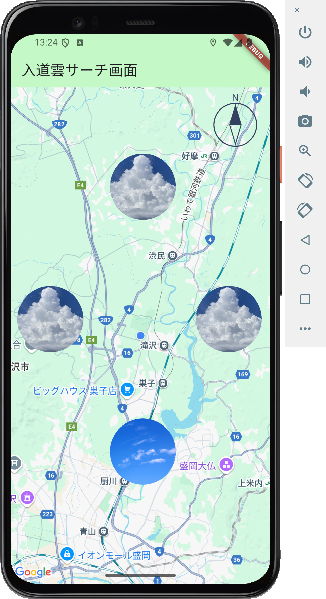

# 入道雲サーチアプリ

## 背景・目的

- **入道雲を見逃さないために**
  自分の好きな入道雲が、どの方向で出現しているかを知りたいという思いから開発しました。
- **自分の好きなもののためにアプリ開発に挑戦**
  趣味としての入道雲観察と Flutter を利用して、実用的なアプリ作成に挑戦。

## 機能

- **リアルタイム積乱雲検出・通知システム**
  現在位置を基準に、東西南北4方向×3距離（50km/160km/250km）の計12地点で積乱雲の発生可能性を分析し、方向別に視覚的に表示します。Cloud Functions により 5分間隔で自動的に各ユーザーの位置周辺をチェックし、積乱雲検出時にはプッシュ通知で即座にお知らせします。

- **高度気象分析による精密判定**
  Open-Meteo APIから以下の専門的な気象データを取得し、積乱雲の可能性を総合的に評価します：
  - **CAPE（対流有効位置エネルギー）**: 対流の強さを示す指標
  - **リフティド指数**: 大気の安定度を示す指標
  - **CIN（対流抑制）**: 対流の抑制力を示す指標
  - **気温・湿度・気圧**: 基本的な気象要素

- **総合スコア表示**
  各指標を重み付けした総合スコア（60%以上で積乱雲の可能性あり）を表示します。

- **Firebase統合システム**
  - **Firestore**: ユーザー位置とFCMトークンの管理
  - **Firebase Cloud Messaging**: プッシュ通知配信
  - **Cloud Functions**: サーバーサイドでの定期的な積乱雲チェック
  - **Firebase Analytics**: 使用状況の分析

- **地図表示**
  現在地や周辺の情報をGoogleMap上に表示し、視覚的に分かりやすくしています。

- **動的UI更新**
  各方向の入道雲情報に応じて、画面上に`CloudAvatar`等のウィジェットを動的に配置し、積乱雲が検出されると雲の画像に、晴天時は青空の画像に自動切り替えします。

## 積乱雲判定ロジック

### **分析指標と重み配分**
| 指標 | 重み | 説明 | 判定基準 |
|------|------|------|----------|
| CAPE | 50% | 対流有効位置エネルギー | 2500+ J/kg: 100%、1000-2500: 80%、500-1000: 60%、100-500: 30%、100未満: 0% |
| リフティド指数 | 35% | 大気安定度 | -6以下: 100%、-3～-6: 80%、0～-3: 60%、3～0: 40%、6～3: 20%、6以上: 0% |
| CIN | 5% | 対流抑制 | 10以下: 30%、50以下: 10%、50以上: 0% |
| 気温 | 10% | 基本気象要素 | 30°C以上: 100%、25-30°C: 80%、20-25°C: 60%、15-20°C: 40%、15°C未満: 0% |

### **検索範囲設定**
- **距離**: 50km（近距離）、160km（中距離）、250km（遠距離）
- **方向**: 北・南・東・西の4方向
- **総チェック地点**: 12地点（4方向 × 3距離）
- **Cloud Functions自動実行**: 5分間隔で全アクティブユーザーをチェック
- **API使用量**: 約17,280リクエスト/日（全ユーザー分、制限内で安全運用）

### **総合判定**
- **60%以上**: 積乱雲の可能性あり（プッシュ通知送信）
- **60%未満**: 積乱雲の可能性低い
- **信頼度**: データの完整性に基づく信頼度（通常100%）

## アーキテクチャ

### **サービス指向アーキテクチャ（SOA）**
アプリは複数の独立したサービスから構成され、各サービスが特定の責務を持ちます：

### **SOA選定理由**
1. **パフォーマンス問題の解決**: 初期版では単一ファイルに機能が集中していた。サービス分離により並列処理とリソース管理を最適化
2. **保守性の向上**: 各サービスが独立した責務を持つため、コードの理解・修正・テストが容易
3. **拡張性の確保**: 新機能追加時に既存コードへの影響を最小化し、モジュール単位での開発が可能
4. **モバイルアプリに適合**: マイクロサービスほど複雑でなく、モノリシックより柔軟な、Flutter アプリに最適な規模感

### **コアサービス**
- **`AppInitialization`**: アプリの初期化プロセスを統括、並列処理により起動速度を大幅に改善
- **`FCMToken`**: Firebase Cloud Messagingトークンの取得・管理・キャッシュ、リトライロジック
- **`Location`**: 位置情報の取得・監視・キャッシュ、リソース管理
- **`PushNotification`**: プッシュ通知メッセージの処理・表示
- **`Notification`**: ローカル通知の管理
- **`Logger`**: 統一されたログ管理システム

### **天気関連サービス**
- **`WeatherDebug`**: 気象データのデバッグ・詳細ログ出力、Open-Meteo APIとの通信
- **`Analyzer`**: 積乱雲分析ロジック

### **ユーティリティ**
- **`Coordinate`**: 座標計算・距離計算のユーティリティ

## ファイル構成

```
thunder_cloud_app/
├── lib/
│   ├── main.dart                                // アプリのエントリーポイント（簡素化済み）
│   ├── firebase_options.dart                    // Firebase設定
│   ├── constants/
│   │   ├── avatar_positions.dart                // ウィジェットの配置位置などの定数
│   │   └── weather.dart                         // 気象分析の重み係数定数
│   ├── models/
│   │   └── assessment.dart                      // 積乱雲評価結果モデル
│   ├── screens/
│   │   └── weather_screen.dart                  // メイン画面（軽量化済み）
│   ├── services/                                // コアサービス層
│   │   ├── app_initialization.dart              // アプリ初期化サービス
│   │   ├── fcm_token.dart                       // FCMトークン管理
│   │   ├── location.dart                        // 位置情報サービス
│   │   ├── notification.dart                    // ローカル通知サービス
│   │   ├── push_notification.dart               // プッシュ通知サービス
│   │   ├── weather_debug.dart                   // 気象デバッグサービス
│   │   └── weather/
│   │       └── analyzer.dart                    // 積乱雲分析ロジック
│   ├── utils/                                   // ユーティリティ層
│   │   ├── logger.dart                          // 統一ログ管理
│   │   └── coordinate.dart                      // 座標計算ユーティリティ
│   └── widgets/
│       ├── cloud/
│       │   ├── cloud_avatar.dart                // 雲/青空画像ウィジェット
│       │   ├── cloud_status_overlay.dart        // 積乱雲情報オーバーレイ
│       │   └── direction_image.dart             // 方向画像ウィジェット
│       ├── common/
│       │   └── app_bar.dart                     // AppBar専用ウィジェット
│       └── map/
│           └── background.dart                  // GoogleMap背景ウィジェット
│
├── functions/                                   // Firebase Cloud Functions
│   ├── src/
│   │   └── index.ts                             // 定期実行される積乱雲チェック機能
│   ├── package.json                             // Node.js依存関係
│   └── tsconfig.json                            // TypeScript設定
├── firestore.rules                              // Firestore セキュリティルール
├── firestore.indexes.json                      // Firestore インデックス設定
└── firebase.json                                // Firebase プロジェクト設定
```

## Firebase Cloud Functions

### **`checkThunderClouds` 関数**
- **実行間隔**: 5分間隔（Pub/Sub トリガー）
- **処理内容**:
  1. Firestoreから全アクティブユーザーの位置情報を取得
  2. 各ユーザーの周辺12地点で気象データを分析
  3. 積乱雲検出時、該当ユーザーにプッシュ通知を送信
  4. エラーハンドリングとログ出力

### **デプロイコマンド**
```bash
firebase deploy --only functions
```

## パフォーマンス最適化

### **実装された最適化**
- **並列初期化**: サービス初期化を並列実行し、起動速度を大幅改善
- **インテリジェントキャッシュ**: FCMトークン、位置情報のキャッシュにより重複処理を削減
- **リソース管理**: 適切なリソース解放とライフサイクル管理
- **効率的なAPI利用**: 必要最小限のAPIリクエストによるパフォーマンス向上
- **CPU使用率削減**: リトライループの最適化により高CPU使用率問題を解決

### **パフォーマンス指標**
- **起動時間**: 大幅短縮（並列初期化により）
- **CPU使用率**: 99% → 正常レベル（最適化後）
- **メモリ使用量**: 効率的なキャッシュ戦略により安定化

## 通知機能

### **プッシュ通知（Firebase Cloud Messaging）**
- **サーバーサイド通知**: Cloud Functions からの自動通知
- **iOS/Android両対応**: プラットフォーム固有の設定に対応
- **バックグラウンド動作**: アプリが非アクティブでも通知受信可能

### **ローカル通知**
- **フォアグラウンド通知**: アプリ起動中の即座通知
- **権限管理**: iOS/Android の通知権限を適切に管理

### **通知の種類**
- **積乱雲発見通知**: 「⛈️ 入道雲を発見！○○方向に入道雲が出現しています」
- **システム通知**: FCMトークン取得、位置情報更新など

## 工夫した点

### **アーキテクチャ設計**
- **サービス指向アーキテクチャ**: 各サービスが独立した責務を持つ設計により、保守性と拡張性を大幅に向上
- **統一ログ管理**: `Logger`による一元化されたログ管理で、デバッグとモニタリングを効率化
- **適切な分離関心**: UI、ビジネスロジック、データアクセス層の明確な分離
- **ファイル命名規則**: ディレクトリ構造で役割を明示し、冗長な接尾辞を排除した簡潔な命名

### **パフォーマンス最適化**
- **並列処理**: アプリ初期化の並列実行により起動時間を大幅短縮
- **インテリジェントキャッシュ**: FCMトークンと位置情報のキャッシュによる重複処理削減
- **リソース管理**: メモリリークを防ぐ適切なライフサイクル管理

### **Firebase統合**
- **Cloud Functions**: サーバーサイドでの定期的な積乱雲チェック
- **Firestore**: スケーラブルなデータストレージ
- **FCM**: 信頼性の高いプッシュ通知システム

### **高度気象分析**
- **専門的な気象データ**: CAPE、LI、CINなどの気象学的指標を活用
- **重み付きスコア計算**: 各指標の重要度を考慮した精密な判定
- **座標計算**: 緯度による経度距離の変動を考慮した正確な距離計算

### **ユーザー体験**
- **リアルタイム更新**: 5分間隔での自動チェック
- **視覚的フィードバック**: 雲/青空画像の動的切り替え
- **直感的なUI**: GoogleMap連携による分かりやすい方向表示

## 使用方法

### **1. セットアップ**

#### **Flutter依存関係のインストール**
```bash
flutter pub get
```

#### **Firebase設定**
1. Firebase Console でプロジェクト作成
2. iOS/Android アプリの登録
3. 設定ファイルのダウンロード：
   - iOS: `ios/Runner/GoogleService-Info.plist`
   - Android: `android/app/google-services.json`

#### **Cloud Functions のデプロイ**
```bash
cd functions
npm install
firebase deploy --only functions
```

#### **Firestore ルールの設定**
```bash
firebase deploy --only firestore:rules
```

### **2. アプリの起動**
```bash
flutter run
```

### **3. 動作確認**
- アプリ起動後、位置情報権限を許可
- 現在地が地図上に表示される
- Cloud Functions により5分間隔で積乱雲チェックが実行される
- 積乱雲検出時、プッシュ通知が配信される

## Firebase プロジェクト設定

### **プロジェクト情報**
- **プロジェクトID**: `thunder-cloud-app-292e6`
- **使用サービス**: Authentication, Firestore, Cloud Functions, Cloud Messaging, Analytics

### **Firestore データ構造**
```
/users/{fcmToken}
├── fcmToken: string      // Firebase Cloud Messaging トークン
├── latitude: number      // 緯度
├── longitude: number     // 経度
├── lastUpdated: timestamp // 最終更新日時
└── isActive: boolean     // アクティブ状態
```

### **セキュリティルール**
現在は開発用の緩いルール設定ですが、本番環境では適切な認証・認可ルールの設定が必要です。

### **開発環境と本番環境の分離**
- **開発環境（kDebugMode=true）**: Firestore への位置情報保存を無効化
- **本番環境（kDebugMode=false）**: 通常の動作で位置情報保存が有効
- **開発用トークン**: `dev_token_`で始まるトークンはFirestore保存対象外

## アプリの動作例

### **高度気象分析ログ出力例**
```
[WeatherDebugService] === 積乱雲分析結果（Open-Meteoのみ）===
[WeatherDebugService] 総合判定: 積乱雲の可能性あり
[WeatherDebugService] 総合スコア: 73.2%
[WeatherDebugService] 信頼度: 100.0%
[WeatherDebugService] リスクレベル: 高い
[WeatherDebugService] East: 積乱雲あり（スコア: 73.2%）
[WeatherDebugService] 詳細分析:
[WeatherDebugService]   - CAPE: 2,847 J/kg (スコア: 100%)
[WeatherDebugService]   - LI: -4.2 (スコア: 80%)
[WeatherDebugService]   - CIN: 8.3 J/kg (スコア: 30%)
[WeatherDebugService]   - 気温: 28.5°C (スコア: 80%)
```

### **アプリスクリーンショット**

<table>
  <tr>
    <td></td>
    <td></td>
  </tr>
</table>

## 今後の展望

### **機能拡張**
- **写真撮影・共有機能**: 入道雲の写真撮影とSNS共有
- **ユーザー認証**: Firebase Authentication による個人データ管理
- **通知カスタマイズ**: ユーザー別の通知設定
- **データ分析**: 積乱雲出現パターンの分析・可視化

### **技術改善**
- **オフライン対応**: データキャッシュによるオフライン機能
- **Push通知最適化**: 高度な通知スケジューリング
- **UI/UX改善**: アニメーション、アクセシビリティ対応
- **テスト自動化**: ユニットテスト、統合テストの拡充

### **スケーラビリティ**
- **マルチリージョン対応**: 世界各地での利用を想定した拡張
- **負荷分散**: Cloud Functions の最適化
- **監視・アラート**: システム監視とエラー通知の強化

## 開発用メモ

### **iOSシミュレータ操作**
```bash
# 利用可能なシミュレータ一覧
xcrun simctl list devices

# シミュレータ起動
xcrun simctl boot <UDID>
xcrun simctl boot CD928AEE-F546-4212-A73D-E491C33E041F

# Simulatorアプリを開く
open -a Simulator
```

### **Firebase コマンド**
```bash
# Functions ログ確認
firebase functions:log

# Firestore データ確認
firebase firestore:delete --all-collections

# プロジェクト情報確認
firebase projects:list
```

### **デバッグコマンド**
```bash
# Flutter デバッグビルド
flutter run --debug

# リリースビルド
flutter build apk --release
flutter build ios --release
```
